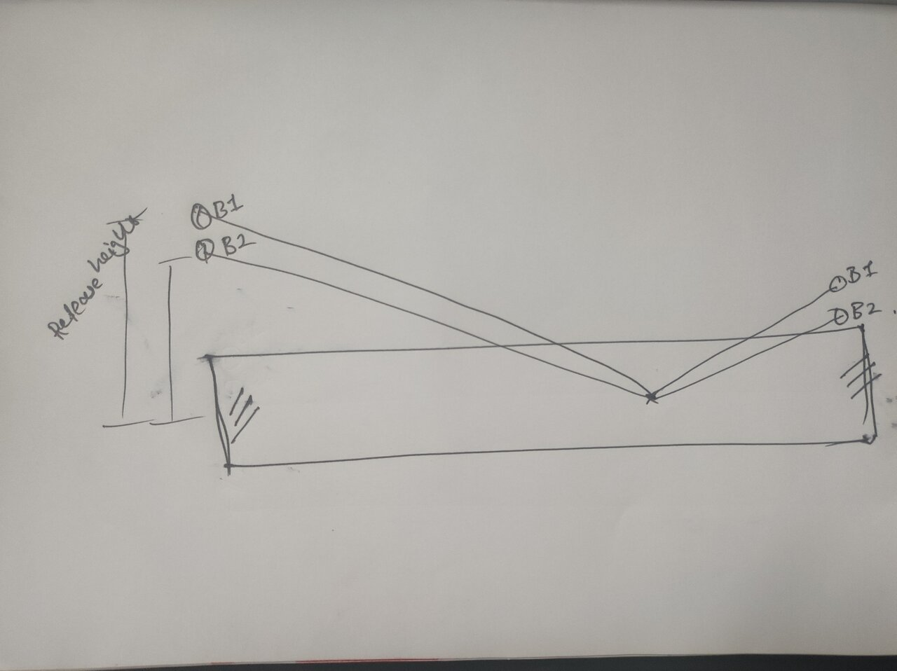

# Cricket Ball Bounce Length Calculator

A web-based application that simulates and compares the trajectories of cricket balls released from different heights, allowing users to visualize how release height affects the ball height at the batting crease.

## Overview

This application provides a visual and numerical comparison of how a cricket ball's release height affects its trajectory and height at the stumps. Users can adjust the release heights of two different balls and their speed, then observe the differences in their heights when reaching the batting crease.

## Dedication

This tool is dedicated to Fakhar-e-Alam, host of the DP World The Dressing Room, whose insights into cricket inspired this project.

## Concept

The application is based on the following conceptual diagram that illustrates how different release heights (RB1, RB2) affect the ball heights at the batting crease (DB1, DB2):



## Features

- Interactive visualization of cricket ball trajectories
- Adjustable parameters:
  - Release heights for two different balls (1.5m to 3.0m)
  - Ball speed (80 km/h to 160 km/h)
- Real-time calculation and rendering of trajectories
- Visual representation of:
  - Release points
  - Pitch points (where the ball hits the ground)
  - Ball heights at stumps
  - Cricket wickets
- Numerical results showing:
  - Height at stumps for each ball
  - Difference in height at stumps between the balls

## Mathematical Model

The simulation uses principles of projectile motion physics with the following key components:

### Constants
- Gravity: 9.81 m/s²
- Pitch distance: 16 meters from release point
- Stumps distance: 22 meters from release point
- Ball radius: 0.036 meters
- Coefficient of restitution: 0.7 (energy loss on bounce)
- Wicket dimensions: 0.7112m height, 0.2286m width

### Trajectory Calculation

1. **Initial Conditions**:
   - Starting position (x=0, y=release height)
   - Ball speed in km/h (converted to m/s)
   - Time step (dt) of 0.01 seconds for simulation

2. **Initial Vertical Velocity Calculation**:
   The initial vertical velocity is calculated to ensure the ball reaches the ground at the pitch point:
   ```
   initialVy = (0.5 * GRAVITY * timeToPitch) - (releaseHeight / timeToPitch)
   ```
   where `timeToPitch = PITCH_DISTANCE / speedMS`

3. **Position Updates**:
   For each time step:
   ```
   x = x + currentVx * dt
   y = y + currentVy * dt
   currentVy = currentVy - GRAVITY * dt  // Gravity effect
   ```

4. **Bounce Physics**:
   When the ball hits the ground, the vertical velocity is reversed and reduced:
   ```
   currentVy = Math.abs(currentVy) * COEFFICIENT_OF_RESTITUTION
   ```

5. **Bounce Point Calculation**:
   The exact bounce point is calculated using the quadratic formula to solve for the time when the ball hits the ground:
   ```
   a = 0.5 * GRAVITY
   b = -currentVy  // Negative because velocity is downward
   c = -y
   t = (-b - Math.sqrt(b*b - 4*a*c)) / (2*a)
   ```
   The bounce position is then calculated as:
   ```
   bounceX = x + currentVx * t
   ```

## How to Use

1. Adjust the release height for Ball 1 (red) and Ball 2 (blue) using the input fields
2. Set the desired ball speed using the speed slider
3. Click "Compare Trajectories" to update the simulation
4. Observe the visual trajectories on the canvas
5. Review the numerical results showing bounce lengths and their difference

## Technical Implementation

- Pure JavaScript for physics calculations and animations
- HTML5 Canvas for rendering trajectories
- Bootstrap 5 for responsive layout and styling
- Custom CSS for visual enhancements

## Browser Compatibility

This application works best in modern browsers that support HTML5 Canvas and ES6 JavaScript features.